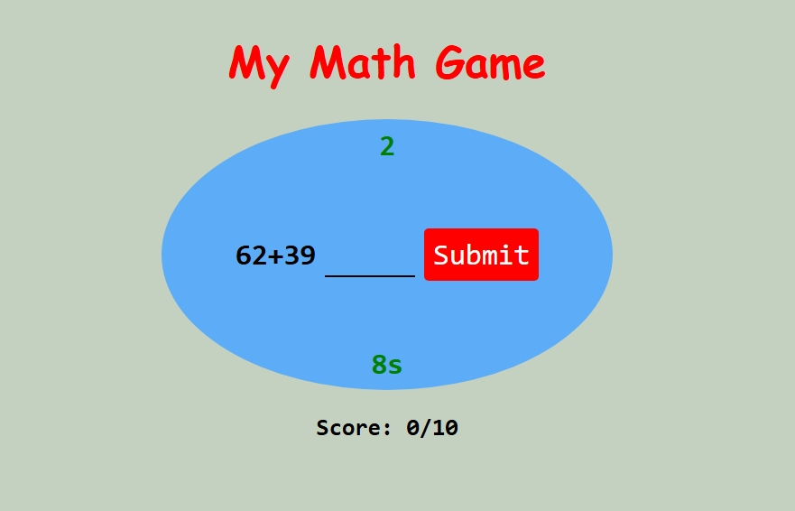

# 🧮 Simple Math Quiz Game

A fun and interactive web-based math quiz game designed to test basic addition skills under a time limit. This project was developed as part of my learning journey in **Vanilla JavaScript** and **DOM Manipulation**.

---

## 🎮 Features

- **Dynamic Questions:** Randomly generates addition problems between numbers 10 and 100.
- **Countdown Timer:** You have 10 seconds per question! If the time runs out, it automatically moves to the next question.
- **Real-time Scoring:** Tracks your correct answers instantly.
- **Session Management:** Each game consists of 10 questions, after which it displays your final score and resets automatically.
- **Validation:** Prevents skipping questions without an answer (unless the timer expires).

## 🚀 Technologies Used

- **HTML5** - Structure of the game.
- **CSS3** - Styling and UI layout.
- **JavaScript (ES6)** - Game logic, timers, and DOM updates.

## 🛠️ How to Run Locally

1. Clone this repository:
   ```bash
   https://vihangamahagamage.github.io/math-game/
   ```

📸 Preview


👨‍💻 Developed By
Vihanga Lochana 🎓 Bachelor of Information and Communication Technology (BICT)

🏛️ University of Kelaniya

🆔 Student ID: CT/2024/035

📝 Learning Outcomes
Through this project, I have mastered the following technical concepts:

Asynchronous JavaScript: Managing countdowns using setInterval and clearing them with clearInterval to prevent memory leaks and logical overlaps.

Game State Management: Implementing logic to start, progress, and reset a session while maintaining data integrity (scores and counts).

Event Handling: Capturing user inputs and button clicks to trigger specific game functions.

DOM Manipulation: Dynamically updating text content and CSS classes to provide immediate feedback to the player.

📜 Credits
Base structure inspired by a JavaScript tutorial on YouTube.

Advanced features including the Countdown Timer, Auto-Transition logic, and State Reset were independently developed to improve functionality and user experience.
